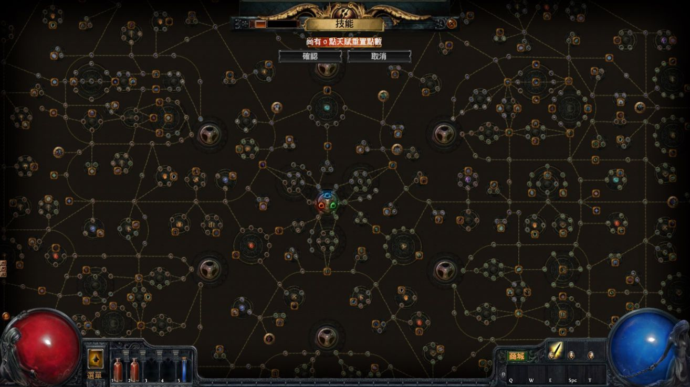

# 個人網站 PRD - 遊戲化互動作品集

## 1. 產品概述

### 1.1 產品願景

打造一個融合遊戲元素的個人作品集網站，透過暗黑風格 RPG 和卡牌遊戲的互動設計，展現個人專業能力與創意特質，讓訪客在探索過程中留下深刻印象。

### 1.2 目標用戶

- **主要用戶：** 潛在雇主、客戶、合作夥伴
- **次要用戶：** 同行開發者、朋友、獵頭顧問
- **用戶特徵：** 對創新技術有興趣、欣賞遊戲化設計、重視使用體驗

### 1.3 核心價值主張

- 🎮 **差異化展示：** 透過遊戲化互動脫穎而出
- 🔥 **技術實力證明：** 展現前端開發和創意設計能力
- 🎯 **記憶點創造：** 讓訪客印象深刻，提高回訪率
- 📱 **優質體驗：** 流暢的互動體驗展現專業素養

## 2. 功能需求

### 2.1 核心功能模組

#### 🏠 首頁 (Landing Page)

**遊戲化概念：** 角色選擇/主城介面

- **視覺效果：** 粒子背景、動態光效
- **互動元素：** 浮動導航選單、滑鼠跟隨效果
- **內容組成：** 個人頭像、簡短標語、導航入口

#### 👤 個人簡介 (About)

**遊戲化概念：** 角色屬性面板 + 職業轉職系統

- **職業發展軌跡：** 展示從後端工程師 → 架構師的轉職路線圖
- **學經歷時間軸：** RPG 經驗值條樣式，顯示各階段成長里程碑
- **當前角色狀態：**
  - 職業：Senior Backend Engineer (目標：Solution Architect)
  - 等級：根據工作年資動態計算
  - 專精領域：後端開發、系統設計、AI 整合
- **屬性面板：**
  - 技術實力 (Technical Skills)
  - 架構思維 (Architecture Thinking)
  - 團隊協作 (Team Collaboration)
  - 問題解決 (Problem Solving)
  - AI 應用 (AI Integration)
- **成就系統：** 重要專案里程碑以成就徽章形式展示
- **自傳區域：** 可展開的職涯故事，重點強調向架構師發展的動機與規劃

#### 💼 工作產值 (Portfolio)

**遊戲化概念：** 裝備展示/戰利品收藏

- **專案展示卡：** 3D 卡牌翻轉效果
- **分類系統：** 不同類型專案以不同邊框顏色區分
- **詳情模態：** 點擊卡牌彈出詳細資訊覆蓋層
- **技術標籤：** 以遊戲標籤形式展示使用技術

#### 🚀 個人專案 (Projects)

**遊戲化概念：** 遊戲王卡牌收藏冊

- **卡牌稀有度系統：**
  - 普通卡 (N) - 學習練習專案
  - 稀有卡 (R) - 具特色功能專案
  - 超稀有卡 (SR) - 獲獎或高影響力專案
- **召喚動畫：** 卡牌從手牌區"召喚"到場上
- **卡牌翻轉：** 正面展示專案，背面展示技術細節
- **連結互動：** 魔法陣傳送效果

#### 🎯 技能展示 (Skills)

**遊戲化概念：** 流亡黯道被動技能樹系統

**視覺參考：**

_參考流亡黯道的被動技能樹介面設計，採用深色背景、金色連線、六角形網格布局_

- **互動式技能樹：** 可拖曳、縮放的六角形網格，從中心起始點向外放射擴展
- **節點層級系統：**
  - **小技能點 (Small Nodes)：** 基礎技能，圓形小點
  - **中型技能點 (Notable Nodes)：** 重要技能，較大圓形
  - **關鍵石 (Keystone Nodes)：** 里程碑技能，大型圓環，各分支核心
- **技能狀態視覺設計：**
  - **已掌握 (已點亮)：** 金橙色發光，與連線同色
  - **可學習 (相鄰可點)：** 淡金色微光提示
  - **未解鎖 (路徑未連通)：** 深灰色暗沉狀態
- **連線路徑系統：** 金色連線顯示技能學習路徑，必須按路徑順序點亮
- **主要技能分支：**
  - **🔧 後端核心 (Backend Core)** - 中央主幹
    - 程式語言精通 (Java/Python/Go/Node.js)
    - 框架應用 (Spring Boot/FastAPI/Express)
    - 資料庫設計 (SQL/NoSQL 設計模式)
  - **🏗️ 系統架構 (System Architecture)** - 右上分支
    - 微服務設計模式
    - 分散式系統設計
    - 高可用架構設計
    - 系統效能調優
  - **☁️ 雲端架構 (Cloud Architecture)** - 右分支
    - 容器化技術 (Docker/K8s)
    - 雲端服務整合 (AWS/GCP/Azure)
    - DevOps/CI-CD 管道設計
    - Infrastructure as Code
  - **🤖 AI/ML 工程 (AI/ML Engineering)** - 左上分支
    - LLM 應用開發
    - Prompt Engineering 精通
    - RAG 系統架構
    - AI Agent 開發框架
    - MLOps 管道設計
  - **📊 資料工程 (Data Engineering)** - 左分支
    - 資料管道設計
    - 即時處理架構 (Kafka/Stream Processing)
    - 資料倉儲建模
    - 大數據架構設計
  - **🔒 安全架構 (Security Architecture)** - 下分支
    - 身份驗證系統設計
    - API 安全設計
    - 資料加密與隱私保護
    - 安全合規架構
  - **👥 技術領導 (Tech Leadership)** - 中心向外環繞
    - 技術決策制定
    - 團隊技術指導
    - 架構評估與選型
    - 技術債務管理
- **天賦連線系統：** 天賦點之間有連線，必須按路徑點亮
- **專精路線：** 從後端工程師 → 資深工程師 → 技術主管 → 系統架構師的成長軌跡可視化

#### 📬 聯絡資訊 (Contact)

**遊戲化概念：** 公會聯繫/好友系統

- **社群連結：** 遊戲圖標樣式按鈕
- **聯繫表單：** 魔法卷軸樣式 (未來擴展)
- **互動元素：** 浮動聯繫方式卡片

### 2.2 進階互動功能

#### 🎨 視覺特效系統

- **粒子系統：** 滑鼠移動產生魔法粒子軌跡
- **光暈效果：** 重要元素的發光邊框動畫
- **視差捲動：** 背景元素多層次移動效果
- **載入動畫：** 遊戲風格的 Loading 畫面

#### 🌳 技能樹互動系統

- **技能點擊效果：** 點擊已掌握技能顯示詳細說明與經驗
- **路徑高亮：** 滑鼠懸停時顯示技能學習路徑
- **專精建議：** 根據目標職位推薦學習路線
- **成長時間軸：** 技能習得的時間順序動畫展示
- **未來規劃：** 未點亮技能展示學習計畫與時程

#### 🎵 音效系統 (可選)

- **互動音效：** 按鈕點擊、卡牌翻轉、技能點亮音效
- **背景音樂：** 低音量環境音樂 (可關閉)
- **音效控制：** 簡潔的音量控制介面

#### 📱 響應式設計

- **桌面優先：** 主要針對桌面瀏覽器優化
- **行動適配：** 簡化互動，保持核心功能
- **觸控優化：** 手機上的觸控手勢支援

## 3. 技術規格

### 3.1 技術棧

- **建構工具：** Vite
- **核心技術：** HTML5, CSS3, ES6+ JavaScript
- **動畫庫：** GSAP (Green Sock Animation Platform)
- **3D 效果：** CSS3 Transform + 少量 Three.js
- **部署平台：** GitHub Pages

### 3.2 效能要求

- **首次載入：** < 3 秒 (3G 網路)
- **互動回應：** < 100ms 延遲
- **動畫流暢度：** 60fps 目標
- **相容性：** Chrome 90+, Firefox 88+, Safari 14+

### 3.3 SEO 與可及性

- **語意化 HTML：** 良好的結構標籤
- **Meta 標籤：** 完整的 Open Graph 支援
- **可及性：** ARIA 標籤、鍵盤導航支援
- **效能優化：** 圖片 lazy loading、資源預載入

## 4. 設計原則

### 4.1 視覺風格

- **主色調：** 深藍 (#1a1a2e) + 暗金 (#d4af37) + 血紅 (#8b0000)
- **字體：** 現代無襯線字體 + 遊戲風格標題字
- **佈局：** 卡片化設計、充足留白、視覺層次清晰

### 4.2 互動哲學

- **直覺性：** 減少學習成本，自然的互動模式
- **回饋性：** 每個互動都有視覺或聽覺回饋
- **探索性：** 鼓勵用戶主動探索隱藏內容
- **流暢性：** 動畫過渡自然，避免突兀跳轉
- **兼顧性：** 不同設備都能有良好的使用體驗(移動端桌面端都能有良好的體驗)

## 5. 成功指標

### 5.1 用戶體驗指標

- **平均停留時間：** > 3 分鐘
- **互動率：** 70% 用戶至少點擊 3 個互動元素
- **完整瀏覽率：** 50% 用戶瀏覽所有主要頁面

### 5.2 技術效能指標

- **Lighthouse 分數：** Performance > 90, Accessibility > 95
- **載入時間：** 首屏 < 2s, 完全載入 < 5s
- **跳出率：** < 40% (相較一般作品集網站)

## 6. 開發里程碑

### Phase 1: 基礎架構 (Week 1-2)

- Vite 專案初始化
- 基本路由和頁面結構
- 核心 CSS 架構建立

### Phase 2: 核心功能 (Week 3-4)

- 流亡黯道風格技能樹系統
- 技能點亮動畫與路徑連線
- 卡牌翻轉動畫
- 粒子效果系統

### Phase 3: 高階互動 (Week 5)

- 技能樹拖曳縮放功能
- 職業發展路線動畫
- 專精建議系統
- 成就徽章展示

### Phase 3: 內容整合 (Week 5)

- 真實內容填入
- 細節動畫調整
- 效能優化

### Phase 4: 測試部署 (Week 6)

- 跨瀏覽器測試
- 響應式調整
- GitHub Pages 部署設置

## 7. 風險與應對

### 7.1 技術風險

- **效能問題：** 過多動畫影響載入速度
  - **應對：** 分階段載入、動畫降級機制
- **相容性問題：** 舊版瀏覽器不支援
  - **應對：** Polyfill + 漸進式增強

### 7.2 設計風險

- **過度設計：** 炫技但影響可用性
  - **應對：** 定期 UX 檢視、A/B 測試概念

### 7.3 內容風險

- **內容不足：** 專案作品數量有限
  - **應對：** 側重質量展示、增加學習專案

## 8. 未來擴展

- **多語言支援：** 中英文切換
- **主題切換：** 不同遊戲風格主題
- **互動小遊戲：** 彩蛋功能增加趣味性
- **後台管理：** 內容管理系統 (長期目標)
