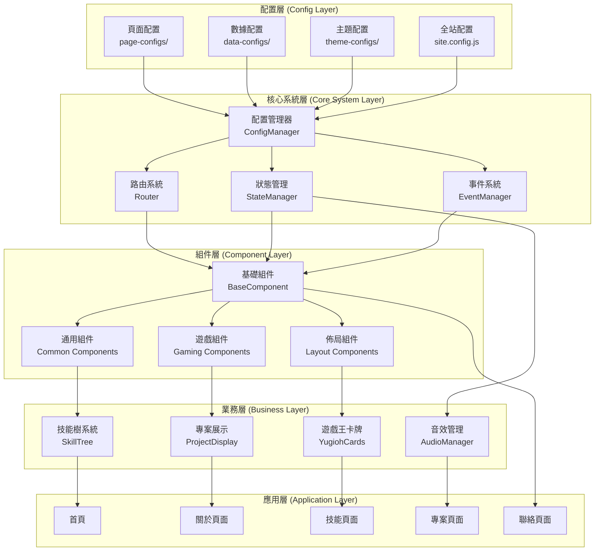

# 技術架構文件 - 遊戲化個人網站 Config-Driven 系統

## 1. 系統概述

### 1.1 架構設計理念

這是一個基於 **Config-Driven 架構** 的遊戲化個人作品集網站，採用純前端技術棧，部署於 GitHub Pages。核心特色是通過配置文件驅動所有內容和行為，實現高度靈活的內容管理和功能擴展。

**核心設計原則：**
- **配置驅動一切**：頁面結構、內容、樣式、行為都通過配置文件控制
- **組件化設計**：所有 UI 元素都封裝為可重用的組件
- **數據與展示分離**：內容數據獨立於展示邏輯
- **靜態部署友好**：純前端架構，無需後端服務器

### 1.2 技術棧選擇

#### 核心技術
- **建構工具**：Vite 4.x - 現代化建構工具，快速開發體驗
- **核心語言**：HTML5, CSS3, ES2022+ JavaScript - 原生技術棧，無框架依賴
- **動畫庫**：GSAP 3.x - 專業級動畫效果
- **包管理**：npm - 依賴管理和腳本執行

#### 輔助工具
- **代碼檢查**：ESLint + Prettier - 代碼品質控制
- **類型檢查**：JSDoc + TypeScript (devDependency) - 類型安全
- **測試框架**：Vitest - 輕量級測試解決方案
- **部署平台**：GitHub Pages - 免費靜態託管

### 1.3 系統特色

#### Config-Driven 核心優勢
1. **易於維護**：修改內容只需編輯配置文件，無需改動代碼
2. **快速迭代**：新增頁面或組件只需添加配置
3. **內容複用**：配置結構標準化，支援模組化重用
4. **多環境支援**：不同環境可使用不同配置文件

## 2. 系統架構設計

### 2.1 整體架構圖



### 2.2 檔案結構設計

```
personal-portfolio/
├── public/                          # 公共靜態資源
│   ├── assets/
│   │   ├── images/                  # 圖片資源
│   │   ├── sounds/                  # 音效文件
│   │   ├── fonts/                   # 字體文件
│   │   └── icons/                   # 圖標資源
│   └── index.html                   # HTML 入口文件
├── src/
│   ├── config/                      # 配置文件層 ⭐️ 核心
│   │   ├── pages/                   # 頁面配置文件
│   │   │   ├── home.config.js       # 首頁配置
│   │   │   ├── about.config.js      # 關於頁面配置
│   │   │   ├── skills.config.js     # 技能頁面配置
│   │   │   ├── portfolio.config.js  # 作品集配置
│   │   │   └── contact.config.js    # 聯絡配置
│   │   ├── data/                    # 數據配置文件
│   │   │   ├── personal.config.js   # 個人資料配置
│   │   │   ├── skills.data.js       # 技能數據配置
│   │   │   ├── projects.data.js     # 專案數據配置
│   │   │   └── social.data.js       # 社交連結配置
│   │   ├── theme/                   # 主題配置文件
│   │   │   ├── colors.config.js     # 色彩配置
│   │   │   ├── typography.config.js # 字體配置
│   │   │   ├── spacing.config.js    # 間距配置
│   │   │   └── animations.config.js # 動畫配置
│   │   └── site.config.js           # 全站通用配置
│   ├── core/                        # 核心系統層
│   │   ├── config/
│   │   │   ├── ConfigManager.js     # 配置管理核心
│   │   │   ├── ConfigValidator.js   # 配置驗證器
│   │   │   └── ConfigLoader.js      # 配置載入器
│   │   ├── router/
│   │   │   ├── Router.js            # SPA 路由系統
│   │   │   └── RouteGuard.js        # 路由守衛
│   │   ├── state/
│   │   │   ├── StateManager.js      # 全域狀態管理
│   │   │   └── Store.js             # 資料存儲
│   │   ├── events/
│   │   │   ├── EventManager.js      # 事件系統
│   │   │   └── EventBus.js          # 事件匯流排
│   │   └── components/
│   │       ├── BaseComponent.js     # 基礎組件類
│   │       ├── ComponentFactory.js  # 組件工廠
│   │       └── ComponentRegistry.js # 組件註冊表
│   ├── components/                  # 可重用組件層
│   │   ├── common/                  # 通用 UI 組件
│   │   │   ├── Button/
│   │   │   ├── Card/
│   │   │   ├── Modal/
│   │   │   └── Loading/
│   │   ├── gaming/                  # 遊戲風格組件
│   │   │   ├── SkillTree/
│   │   │   ├── ProjectCard/
│   │   │   ├── YugiohCard/
│   │   │   └── ParticleSystem/
│   │   └── layout/                  # 佈局組件
│   │       ├── Header/
│   │       ├── Navigation/
│   │       ├── Footer/
│   │       └── Container/
│   ├── pages/                       # 頁面組件
│   │   ├── HomePage.js
│   │   ├── AboutPage.js
│   │   ├── SkillsPage.js
│   │   ├── PortfolioPage.js
│   │   └── ContactPage.js
│   ├── systems/                     # 功能系統
│   │   ├── AudioManager/            # 音效管理系統
│   │   ├── AnimationManager/        # 動畫管理系統
│   │   ├── PreloadManager/          # 資源預載管理
│   │   └── ThemeManager/            # 主題管理系統
│   ├── utils/                       # 工具函數
│   │   ├── helpers.js               # 通用輔助函數
│   │   ├── validators.js            # 驗證函數
│   │   ├── formatters.js            # 格式化函數
│   │   └── constants.js             # 常數定義
│   ├── styles/                      # 樣式文件
│   │   ├── global.css               # 全域樣式
│   │   ├── variables.css            # CSS 變數
│   │   ├── components/              # 組件樣式
│   │   └── themes/                  # 主題樣式
│   └── main.js                      # 應用入口文件
├── tests/                           # 測試文件
│   ├── unit/                        # 單元測試
│   ├── integration/                 # 整合測試
│   └── e2e/                         # 端對端測試
├── docs/                            # 文檔
│   ├── technical_architecture.md    # 技術架構文檔
│   ├── config_guide.md             # 配置使用指南
│   └── component_api.md            # 組件 API 文檔
├── .github/
│   └── workflows/
│       ├── deploy.yml               # 自動部署工作流
│       └── test.yml                 # 測試工作流
├── package.json                     # 項目配置文件
├── vite.config.js                   # Vite 配置
├── .eslintrc.js                     # ESLint 配置
├── .prettierrc                      # Prettier 配置
├── CLAUDE.md                        # 開發指南
└── README.md                        # 項目說明
```

## 3. Config-Driven 系統設計

### 3.1 配置管理核心架構

#### ConfigManager - 配置管理器

```javascript
/**
 * 配置管理核心類
 * 負責載入、驗證、合併所有配置文件
 */
class ConfigManager {
  constructor() {
    this.configs = new Map();
    this.validators = new Map();
    this.watchers = new Set();
    this.isInitialized = false;
  }

  /**
   * 初始化配置系統
   * @returns {Promise<void>}
   */
  async initialize() {
    try {
      await this.loadSiteConfig();
      await this.loadPageConfigs();
      await this.loadDataConfigs();
      await this.loadThemeConfigs();
      
      this.validateAllConfigs();
      this.mergeConfigs();
      this.notifyWatchers();
      
      this.isInitialized = true;
    } catch (error) {
      console.error('配置系統初始化失敗:', error);
      throw error;
    }
  }

  /**
   * 載入站點配置
   */
  async loadSiteConfig() {
    const siteConfig = await import('../config/site.config.js');
    this.configs.set('site', siteConfig.default);
  }

  /**
   * 載入頁面配置
   */
  async loadPageConfigs() {
    const pageConfigs = {};
    const configFiles = [
      'home', 'about', 'skills', 'portfolio', 'contact'
    ];

    for (const page of configFiles) {
      try {
        const config = await import(`../config/pages/${page}.config.js`);
        pageConfigs[page] = config.default;
      } catch (error) {
        console.warn(`頁面配置載入失敗: ${page}`, error);
      }
    }

    this.configs.set('pages', pageConfigs);
  }

  /**
   * 獲取配置
   * @param {string} path - 配置路徑，如 'pages.home.title'
   * @returns {any} 配置值
   */
  get(path) {
    const keys = path.split('.');
    let result = this.configs;

    for (const key of keys) {
      if (result instanceof Map) {
        result = result.get(key);
      } else if (result && typeof result === 'object') {
        result = result[key];
      } else {
        return undefined;
      }

      if (result === undefined) {
        return undefined;
      }
    }

    return result;
  }

  /**
   * 設置配置
   * @param {string} path - 配置路徑
   * @param {any} value - 配置值
   */
  set(path, value) {
    // 運行時配置更新邏輯
    // 主要用於主題切換、動態內容更新等
  }

  /**
   * 監聽配置變化
   * @param {Function} callback - 回調函數
   */
  watch(callback) {
    this.watchers.add(callback);
    return () => this.watchers.delete(callback);
  }
}

// 單例導出
export const configManager = new ConfigManager();
```

### 3.2 配置文件結構設計

#### 頁面配置結構 (pages/*.config.js)

```javascript
// src/config/pages/home.config.js
export default {
  meta: {
    title: "首頁 - 遊戲化作品集",
    description: "歡迎來到我的遊戲化個人作品集網站",
    keywords: ["前端開發", "遊戲化", "作品集"],
    ogImage: "/assets/images/og-home.jpg"
  },

  layout: {
    type: "fullscreen",
    backgroundType: "particles",
    maxWidth: "none",
    padding: "0"
  },

  sections: [
    {
      id: "hero-section",
      type: "hero",
      order: 1,
      visible: true,
      config: {
        animation: "fadeInUp",
        delay: 0,
        duration: 1000
      },
      content: {
        avatar: {
          src: "{{personal.avatar}}",
          alt: "{{personal.name}}的頭像",
          animation: "rotate"
        },
        title: {
          text: "{{personal.title}}",
          animation: "typewriter",
          speed: 100
        },
        subtitle: {
          text: "{{personal.subtitle}}",
          animation: "fadeIn",
          delay: 1500
        },
        navigation: {
          type: "circular",
          items: "{{site.navigation.main}}"
        }
      }
    },
    
    {
      id: "background-particles",
      type: "particle-system",
      order: 0,
      config: {
        count: 50,
        colors: ["{{theme.colors.primary}}", "{{theme.colors.secondary}}"],
        speed: 1,
        size: { min: 2, max: 5 },
        followCursor: true
      }
    }
  ],

  interactions: {
    mouseEffects: {
      cursor: "glow",
      particles: true,
      ripple: false
    },
    
    keyboardShortcuts: [
      { key: "h", action: "goToHome" },
      { key: "a", action: "goToAbout" },
      { key: "s", action: "goToSkills" }
    ],

    audioTriggers: [
      { event: "pageLoad", sound: "welcome" },
      { event: "buttonHover", sound: "hover" },
      { event: "buttonClick", sound: "click" }
    ]
  },

  seo: {
    structuredData: {
      "@type": "Person",
      "name": "{{personal.name}}",
      "jobTitle": "{{personal.jobTitle}}",
      "url": "{{site.url}}"
    }
  }
};
```

#### 數據配置結構 (data/*.config.js)

```javascript
// src/config/data/skills.data.js
export default {
  skillTree: {
    center: { x: 0, y: 0 },
    hexSize: 40,
    connectionStyle: "golden",
    
    nodes: [
      {
        id: "backend-core",
        position: { q: 0, r: 0 },
        type: "keystone",
        name: "後端核心",
        description: "後端開發基礎技能",
        status: "mastered",
        icon: "server",
        children: ["java-programming", "python-programming", "database-design"],
        
        details: {
          experience: "5+ 年",
          projects: ["project-1", "project-2"],
          certifications: [],
          relatedSkills: ["system-design", "api-design"]
        }
      },

      {
        id: "java-programming",
        position: { q: -1, r: 0 },
        type: "notable",
        name: "Java 程式設計",
        description: "Java 企業級開發",
        status: "mastered",
        icon: "java",
        prerequisites: ["backend-core"],
        children: ["spring-boot", "microservices"],

        skillDetails: {
          proficiency: 90,
          yearsOfExperience: 5,
          frameworks: ["Spring Boot", "Spring Cloud", "Hibernate"],
          projects: [
            {
              name: "微服務重構專案",
              description: "將單體應用重構為微服務架構",
              techStack: ["Java 11", "Spring Boot", "Docker"],
              impact: "系統性能提升 40%"
            }
          ],
          certifications: ["Oracle Certified Java Programmer"],
          learningPath: {
            completed: ["Java 基礎", "OOP", "集合框架", "多執行緒"],
            inProgress: ["虛擬執行緒", "新語言特性"],
            planned: ["GraalVM", "Project Loom"]
          }
        }
      },

      // ... 更多技能節點
    ],

    branches: [
      {
        id: "backend-track",
        name: "後端開發軌跡",
        description: "從初級到資深的後端開發路線",
        color: "gold",
        nodes: ["backend-core", "java-programming", "spring-boot", "microservices"]
      },
      
      {
        id: "architecture-track", 
        name: "架構師軌跡",
        description: "系統架構設計能力發展",
        color: "blue",
        nodes: ["system-design", "distributed-systems", "cloud-architecture"]
      },

      {
        id: "ai-track",
        name: "AI 工程軌跡", 
        description: "人工智慧應用開發",
        color: "purple",
        nodes: ["llm-development", "prompt-engineering", "ai-integration"]
      }
    ]
  },

  // 技能類別定義
  categories: {
    "programming-languages": {
      name: "程式語言",
      icon: "code",
      description: "掌握的程式語言"
    },
    "frameworks": {
      name: "框架技術",
      icon: "layer-group", 
      description: "常用開發框架"
    },
    "tools": {
      name: "開發工具",
      icon: "tools",
      description: "開發和部署工具"
    }
  },

  // 熟練度等級定義
  proficiencyLevels: {
    beginner: { name: "初學者", min: 0, max: 30, color: "#95a5a6" },
    intermediate: { name: "中級", min: 31, max: 60, color: "#3498db" },
    advanced: { name: "高級", min: 61, max: 85, color: "#f39c12" },
    expert: { name: "專家", min: 86, max: 100, color: "#d4af37" }
  }
};
```

#### 專案配置結構 (data/projects.data.js)

```javascript
// src/config/data/projects.data.js
export default {
  // 專案展示配置
  portfolioProjects: [
    {
      id: "microservices-refactor",
      title: "微服務架構重構專案",
      category: "system-architecture",
      rarity: "legendary",
      type: "work-project",
      
      overview: {
        description: "將單體電商應用重構為微服務架構，提升系統可擴展性和維護性",
        duration: "6個月",
        teamSize: 8,
        role: "技術主導"
      },

      technical: {
        stack: {
          backend: ["Java 11", "Spring Boot", "Spring Cloud"],
          database: ["MySQL", "Redis", "MongoDB"],
          infrastructure: ["Docker", "Kubernetes", "Istio"],
          monitoring: ["Prometheus", "Grafana", "ELK Stack"]
        },
        
        architecture: {
          pattern: "微服務架構",
          communication: "REST API + Event-Driven",
          dataConsistency: "Saga Pattern",
          deployment: "CI/CD Pipeline"
        }
      },

      achievements: [
        {
          metric: "系統響應時間",
          improvement: "40%",
          details: "平均 API 回應時間從 800ms 降至 480ms"
        },
        {
          metric: "部署頻率", 
          improvement: "10x",
          details: "從每月部署變為每日部署"
        },
        {
          metric: "系統可用性",
          improvement: "99.9%",
          details: "達到 SLA 要求的高可用性"
        }
      ],

      challenges: [
        {
          challenge: "分散式事務處理",
          solution: "實作 Saga Pattern 確保數據一致性",
          learned: "深入理解分散式系統的 CAP 定理"
        },
        {
          challenge: "服務治理複雜度", 
          solution: "導入 Istio 服務網格統一管理",
          learned: "服務網格在微服務治理中的重要性"
        }
      ],

      display: {
        cardPreview: {
          image: "/assets/projects/microservices-architecture.jpg",
          tags: ["Java", "Spring Cloud", "Kubernetes"],
          highlights: ["系統性能提升 40%", "支援 10x 併發量"]
        },
        
        detailModal: {
          gallery: [
            "/assets/projects/microservices-arch-diagram.jpg",
            "/assets/projects/performance-metrics.jpg",
            "/assets/projects/deployment-pipeline.jpg"
          ],
          
          links: {
            documentation: "/docs/microservices-project",
            presentation: "/assets/presentations/microservices-refactor.pdf"
          }
        }
      }
    }
  ],

  // 個人專案（遊戲王卡牌風格）
  personalProjects: [
    {
      id: "ai-chatbot",
      name: "AI 聊天機器人",
      type: "AI Application",
      rarity: "SR",
      level: 7,
      
      yugiohCard: {
        attack: 2500,  // 專案複雜度
        defense: 2100, // 程式碼品質 
        attribute: "AI",
        description: "整合 OpenAI API 的智慧對話系統，具備上下文理解與多輪對話能力",
        effect: "召喚時：可以處理自然語言查詢，提供智慧回應",
        artwork: "/assets/cards/ai-chatbot-art.jpg",
        foil: true
      },

      technical: {
        stack: ["Python", "FastAPI", "OpenAI API", "PostgreSQL", "Redis"],
        features: [
          "多輪對話管理",
          "上下文記憶",
          "意圖識別",
          "情感分析",
          "API 限流保護"
        ],
        architecture: "RESTful API + 非同步處理"
      },

      metrics: {
        responseTime: "< 2s",
        accuracy: "85%",
        userSatisfaction: "4.2/5",
        dailyUsers: "500+"
      },

      links: {
        github: "https://github.com/username/ai-chatbot",
        demo: "https://chatbot-demo.vercel.app",
        documentation: "/docs/ai-chatbot"
      }
    }
  ],

  // 專案分類
  categories: {
    "system-architecture": {
      name: "系統架構",
      icon: "sitemap",
      color: "#3498db",
      description: "大型系統架構設計與重構專案"
    },
    "ai-ml": {
      name: "AI/ML 應用",
      icon: "robot",
      color: "#9b59b6", 
      description: "人工智慧與機器學習應用專案"
    },
    "fullstack": {
      name: "全端開發",
      icon: "layer-group",
      color: "#e67e22",
      description: "前後端整合的完整應用"
    }
  },

  // 稀有度系統
  raritySystem: {
    "N": {
      name: "普通",
      color: "#95a5a6",
      description: "學習練習專案"
    },
    "R": {
      name: "稀有", 
      color: "#3498db",
      description: "具特色功能的專案"
    },
    "SR": {
      name: "超稀有",
      color: "#9b59b6", 
      description: "獲獎或高影響力專案"
    },
    "UR": {
      name: "傳說",
      color: "#d4af37",
      description: "里程碑級別的重要專案"
    }
  }
};
```

#### 主題配置結構 (theme/*.config.js)

```javascript
// src/config/theme/colors.config.js
export default {
  // 主色調系統
  primary: {
    dark: "#0a0a0a",
    secondary: "#1a1a2e", 
    tertiary: "#16213e",
    surface: "#2c3e50"
  },

  accent: {
    gold: {
      primary: "#d4af37",
      bright: "#f4d03f", 
      dark: "#b8941f",
      pale: "#f8e6a0"
    },
    blue: {
      primary: "#2980b9",
      bright: "#3498db",
      deep: "#1f3a93",
      ice: "#ebf3fd"
    },
    red: {
      primary: "#8b0000",
      bright: "#c0392b",
      fire: "#e74c3c",
      pale: "#fadbd8"
    }
  },

  // 功能色彩
  semantic: {
    success: "#27ae60",
    warning: "#f39c12", 
    error: "#e74c3c",
    info: "#3498db"
  },

  // 遊戲化色彩系統
  gaming: {
    rarity: {
      common: "#95a5a6",
      rare: "#3498db", 
      epic: "#9b59b6",
      legendary: "#d4af37"
    },
    
    skillStatus: {
      mastered: "#d4af37",
      available: "#3498db", 
      locked: "#7f8c8d",
      keystone: "#f4d03f"
    }
  },

  // 無障礙支援
  accessibility: {
    highContrast: {
      text: "#ffffff",
      background: "#000000", 
      accent: "#ffff00"
    },
    
    colorBlind: {
      safe: ["#1f77b4", "#ff7f0e", "#2ca02c", "#d62728"]
    }
  }
};
```

### 3.3 配置驅動的組件系統

#### 基礎組件類設計

```javascript
// src/core/components/BaseComponent.js
import { configManager } from '../config/ConfigManager.js';
import { eventManager } from '../events/EventManager.js';

export class BaseComponent {
  constructor(element, config = {}) {
    this.element = element;
    this.config = this.mergeConfig(config);
    this.state = this.getInitialState();
    this.isInitialized = false;
    
    this.init();
  }

  /**
   * 合併預設配置與傳入配置
   */
  mergeConfig(userConfig) {
    const defaultConfig = this.getDefaultConfig();
    const themeConfig = this.getThemeConfig();
    
    return {
      ...defaultConfig,
      ...themeConfig,
      ...userConfig
    };
  }

  /**
   * 獲取元件預設配置
   * 子類別應覆寫此方法
   */
  getDefaultConfig() {
    return {};
  }

  /**
   * 獲取主題相關配置
   */
  getThemeConfig() {
    const componentName = this.constructor.name.toLowerCase();
    return configManager.get(`theme.components.${componentName}`) || {};
  }

  /**
   * 獲取初始狀態
   * 子類別應覆寫此方法
   */
  getInitialState() {
    return {};
  }

  /**
   * 組件初始化
   */
  async init() {
    try {
      await this.beforeInit();
      await this.render();
      await this.bindEvents();
      await this.afterInit();
      
      this.isInitialized = true;
      this.emit('initialized', this);
    } catch (error) {
      console.error(`Component ${this.constructor.name} 初始化失敗:`, error);
      throw error;
    }
  }

  /**
   * 初始化前鉤子
   */
  async beforeInit() {
    // 子類別可覆寫
  }

  /**
   * 渲染組件
   */
  async render() {
    // 子類別必須實作
    throw new Error('render 方法必須由子類別實作');
  }

  /**
   * 綁定事件
   */
  async bindEvents() {
    // 子類別可覆寫
  }

  /**
   * 初始化後鉤子
   */
  async afterInit() {
    // 子類別可覆寫
  }

  /**
   * 更新狀態
   */
  setState(newState) {
    const prevState = { ...this.state };
    this.state = { ...this.state, ...newState };
    
    this.emit('stateChange', {
      prevState,
      currentState: this.state,
      component: this
    });
  }

  /**
   * 發送事件
   */
  emit(eventName, data) {
    eventManager.emit(`component:${this.constructor.name}:${eventName}`, data);
  }

  /**
   * 監聽事件
   */
  on(eventName, callback) {
    return eventManager.on(`component:${this.constructor.name}:${eventName}`, callback);
  }

  /**
   * 銷毀組件
   */
  destroy() {
    this.emit('beforeDestroy', this);
    
    // 清理事件監聽器
    this.unbindEvents();
    
    // 移除 DOM 元素
    if (this.element && this.element.parentNode) {
      this.element.parentNode.removeChild(this.element);
    }
    
    this.emit('destroyed', this);
  }

  /**
   * 解除事件綁定
   */
  unbindEvents() {
    // 子類別可覆寫
  }
}
```

## 4. 頁面組件系統

### 4.1 頁面配置驅動渲染

```javascript
// src/core/PageRenderer.js
import { configManager } from './config/ConfigManager.js';
import { componentFactory } from './components/ComponentFactory.js';

export class PageRenderer {
  constructor() {
    this.currentPage = null;
    this.components = new Map();
  }

  /**
   * 渲染頁面
   * @param {string} pageName - 頁面名稱
   * @param {HTMLElement} container - 容器元素
   */
  async renderPage(pageName, container) {
    try {
      // 獲取頁面配置
      const pageConfig = configManager.get(`pages.${pageName}`);
      if (!pageConfig) {
        throw new Error(`頁面配置不存在: ${pageName}`);
      }

      // 清理前一個頁面
      this.cleanup();

      // 設置頁面 meta 資訊
      this.setPageMeta(pageConfig.meta);

      // 應用頁面佈局
      this.applyLayout(container, pageConfig.layout);

      // 按順序渲染各區塊
      const sections = pageConfig.sections
        .sort((a, b) => (a.order || 0) - (b.order || 0))
        .filter(section => section.visible !== false);

      for (const section of sections) {
        await this.renderSection(section, container);
      }

      // 設置頁面互動
      this.setupInteractions(pageConfig.interactions);

      this.currentPage = pageName;
      
    } catch (error) {
      console.error('頁面渲染失敗:', error);
      this.renderErrorPage(container, error);
    }
  }

  /**
   * 設置頁面 Meta 資訊
   */
  setPageMeta(meta) {
    if (!meta) return;

    document.title = this.interpolateVariables(meta.title);
    
    // 更新 meta 標籤
    this.updateMetaTag('description', meta.description);
    this.updateMetaTag('keywords', meta.keywords?.join(', '));
    
    // 更新 Open Graph 標籤
    this.updateMetaTag('og:title', meta.title, 'property');
    this.updateMetaTag('og:description', meta.description, 'property');
    this.updateMetaTag('og:image', meta.ogImage, 'property');
  }

  /**
   * 更新 Meta 標籤
   */
  updateMetaTag(name, content, attribute = 'name') {
    if (!content) return;

    let meta = document.querySelector(`meta[${attribute}="${name}"]`);
    if (!meta) {
      meta = document.createElement('meta');
      meta.setAttribute(attribute, name);
      document.head.appendChild(meta);
    }
    meta.setAttribute('content', this.interpolateVariables(content));
  }

  /**
   * 渲染區塊
   */
  async renderSection(sectionConfig, container) {
    const { id, type, config, content } = sectionConfig;

    // 創建區塊元素
    const sectionElement = document.createElement('section');
    sectionElement.id = id;
    sectionElement.className = `section section--${type}`;

    // 應用配置樣式
    if (config?.animation) {
      sectionElement.setAttribute('data-animation', config.animation);
    }

    // 根據類型創建組件
    const component = await componentFactory.create(type, sectionElement, {
      ...config,
      content: this.interpolateContent(content)
    });

    if (component) {
      this.components.set(id, component);
    }

    container.appendChild(sectionElement);
  }

  /**
   * 插值處理 - 將 {{變數}} 替換為實際值
   */
  interpolateVariables(text) {
    if (typeof text !== 'string') return text;

    return text.replace(/\{\{([^}]+)\}\}/g, (match, path) => {
      const value = configManager.get(path.trim());
      return value !== undefined ? value : match;
    });
  }

  /**
   * 插值處理內容物件
   */
  interpolateContent(content) {
    if (!content) return content;

    const interpolated = {};
    for (const [key, value] of Object.entries(content)) {
      if (typeof value === 'string') {
        interpolated[key] = this.interpolateVariables(value);
      } else if (typeof value === 'object' && value !== null) {
        interpolated[key] = this.interpolateContent(value);
      } else {
        interpolated[key] = value;
      }
    }
    return interpolated;
  }

  /**
   * 清理當前頁面
   */
  cleanup() {
    // 銷毀所有組件
    for (const component of this.components.values()) {
      if (component.destroy) {
        component.destroy();
      }
    }
    this.components.clear();
  }
}
```

### 4.2 組件工廠系統

```javascript
// src/core/components/ComponentFactory.js
import { SkillTree } from '../../components/gaming/SkillTree/SkillTree.js';
import { ProjectCard } from '../../components/gaming/ProjectCard/ProjectCard.js';
import { YugiohCard } from '../../components/gaming/YugiohCard/YugiohCard.js';
import { ParticleSystem } from '../../components/gaming/ParticleSystem/ParticleSystem.js';

class ComponentFactory {
  constructor() {
    this.registry = new Map();
    this.registerDefaultComponents();
  }

  /**
   * 註冊預設組件
   */
  registerDefaultComponents() {
    this.register('skill-tree', SkillTree);
    this.register('project-card', ProjectCard);
    this.register('yugioh-card', YugiohCard);
    this.register('particle-system', ParticleSystem);
    this.register('hero', HeroSection);
    this.register('about-profile', AboutProfile);
    this.register('project-grid', ProjectGrid);
  }

  /**
   * 註冊組件類型
   */
  register(type, componentClass) {
    this.registry.set(type, componentClass);
  }

  /**
   * 創建組件實例
   */
  async create(type, element, config = {}) {
    const ComponentClass = this.registry.get(type);
    
    if (!ComponentClass) {
      console.warn(`未知的組件類型: ${type}`);
      return null;
    }

    try {
      const component = new ComponentClass(element, config);
      await component.init();
      return component;
    } catch (error) {
      console.error(`組件創建失敗 [${type}]:`, error);
      throw error;
    }
  }

  /**
   * 獲取已註冊的組件類型
   */
  getRegisteredTypes() {
    return Array.from(this.registry.keys());
  }
}

export const componentFactory = new ComponentFactory();
```

## 5. 路由系統設計

### 5.1 SPA 路由系統

```javascript
// src/core/router/Router.js
import { configManager } from '../config/ConfigManager.js';
import { PageRenderer } from '../PageRenderer.js';

export class Router {
  constructor() {
    this.routes = new Map();
    this.currentRoute = null;
    this.pageRenderer = new PageRenderer();
    this.container = null;
    
    this.initializeRoutes();
    this.bindEvents();
  }

  /**
   * 初始化路由配置
   */
  initializeRoutes() {
    const siteConfig = configManager.get('site');
    const routes = siteConfig.routes || {
      '/': 'home',
      '/about': 'about',
      '/skills': 'skills', 
      '/portfolio': 'portfolio',
      '/contact': 'contact'
    };

    for (const [path, pageName] of Object.entries(routes)) {
      this.addRoute(path, pageName);
    }
  }

  /**
   * 添加路由
   */
  addRoute(path, pageName) {
    this.routes.set(path, pageName);
  }

  /**
   * 綁定事件
   */
  bindEvents() {
    // 監聽瀏覽器前後退按鈕
    window.addEventListener('popstate', (event) => {
      this.handlePopState(event);
    });

    // 監聽頁面載入
    window.addEventListener('load', () => {
      this.handleInitialRoute();
    });

    // 攔截連結點擊
    document.addEventListener('click', (event) => {
      this.handleLinkClick(event);
    });
  }

  /**
   * 處理初始路由
   */
  handleInitialRoute() {
    const currentPath = window.location.pathname;
    this.navigate(currentPath, { replaceState: true });
  }

  /**
   * 處理連結點擊
   */
  handleLinkClick(event) {
    const link = event.target.closest('a[href]');
    if (!link) return;

    const href = link.getAttribute('href');
    
    // 只處理內部連結
    if (href.startsWith('/') || href.startsWith('#/')) {
      event.preventDefault();
      this.navigate(href);
    }
  }

  /**
   * 導航到指定路由
   */
  async navigate(path, options = {}) {
    try {
      const pageName = this.routes.get(path);
      
      if (!pageName) {
        console.warn(`未找到路由: ${path}`);
        this.navigate('/404');
        return;
      }

      // 更新瀏覽器歷史
      if (options.replaceState) {
        history.replaceState({ path, pageName }, '', path);
      } else {
        history.pushState({ path, pageName }, '', path);
      }

      // 渲染頁面
      await this.renderPage(pageName);
      
      this.currentRoute = { path, pageName };
      
      // 觸發路由變更事件
      this.emit('routeChanged', { path, pageName });
      
    } catch (error) {
      console.error('路由導航失敗:', error);
      this.renderErrorPage(error);
    }
  }

  /**
   * 渲染頁面
   */
  async renderPage(pageName) {
    if (!this.container) {
      this.container = document.getElementById('app') || document.body;
    }

    // 添加載入狀態
    this.showLoading();

    try {
      await this.pageRenderer.renderPage(pageName, this.container);
      this.hideLoading();
    } catch (error) {
      this.hideLoading();
      throw error;
    }
  }

  /**
   * 顯示載入狀態
   */
  showLoading() {
    document.body.classList.add('page-loading');
  }

  /**
   * 隱藏載入狀態
   */
  hideLoading() {
    document.body.classList.remove('page-loading');
  }

  /**
   * 獲取當前路由
   */
  getCurrentRoute() {
    return this.currentRoute;
  }

  /**
   * 發送事件
   */
  emit(eventName, data) {
    const event = new CustomEvent(`router:${eventName}`, { detail: data });
    window.dispatchEvent(event);
  }
}
```

## 6. 部署與建構系統

### 6.1 Vite 配置

```javascript
// vite.config.js
import { defineConfig } from 'vite';
import { resolve } from 'path';

export default defineConfig({
  // 基礎配置
  base: process.env.NODE_ENV === 'production' ? '/personal-portfolio/' : '/',
  
  // 建構配置
  build: {
    outDir: 'dist',
    assetsDir: 'assets',
    sourcemap: process.env.NODE_ENV !== 'production',
    
    // 代碼分割
    rollupOptions: {
      input: {
        main: resolve(__dirname, 'index.html'),
      },
      
      output: {
        // 靜態資源命名
        assetFileNames: (assetInfo) => {
          const info = assetInfo.name.split('.');
          const ext = info[info.length - 1];
          
          if (/\.(mp3|wav|ogg)$/.test(assetInfo.name)) {
            return `assets/sounds/[name]-[hash].${ext}`;
          }
          
          if (/\.(png|jpe?g|svg|gif|webp|avif)$/.test(assetInfo.name)) {
            return `assets/images/[name]-[hash].${ext}`;
          }
          
          if (/\.(woff2?|eot|ttf|otf)$/.test(assetInfo.name)) {
            return `assets/fonts/[name]-[hash].${ext}`;
          }
          
          return `assets/[name]-[hash].${ext}`;
        },
        
        // JavaScript 分塊
        chunkFileNames: 'assets/js/[name]-[hash].js',
        entryFileNames: 'assets/js/[name]-[hash].js',
        
        // 手動分塊
        manualChunks: {
          // 第三方庫分塊
          'vendor': ['gsap'],
          
          // 組件分塊
          'components-gaming': [
            './src/components/gaming/SkillTree/SkillTree.js',
            './src/components/gaming/ProjectCard/ProjectCard.js',
            './src/components/gaming/YugiohCard/YugiohCard.js'
          ],
          
          // 系統分塊
          'core-system': [
            './src/core/config/ConfigManager.js',
            './src/core/router/Router.js',
            './src/core/components/BaseComponent.js'
          ]
        }
      }
    },
    
    // 壓縮配置
    terserOptions: {
      compress: {
        drop_console: process.env.NODE_ENV === 'production',
        drop_debugger: process.env.NODE_ENV === 'production'
      }
    }
  },
  
  // 開發服務器配置
  server: {
    port: 3000,
    open: true,
    cors: true
  },
  
  // 路徑別名
  resolve: {
    alias: {
      '@': resolve(__dirname, 'src'),
      '@config': resolve(__dirname, 'src/config'),
      '@components': resolve(__dirname, 'src/components'),
      '@core': resolve(__dirname, 'src/core'),
      '@utils': resolve(__dirname, 'src/utils'),
      '@assets': resolve(__dirname, 'public/assets')
    }
  },
  
  // CSS 配置
  css: {
    devSourcemap: true,
    preprocessorOptions: {
      scss: {
        additionalData: `@import "@/styles/variables.scss";`
      }
    }
  },
  
  // 插件配置
  plugins: [
    // PWA 支援 (可選)
    // VitePWA({
    //   registerType: 'autoUpdate',
    //   workbox: {
    //     globPatterns: ['**/*.{js,css,html,ico,png,svg,jpg,jpeg,gif,webp,woff,woff2}']
    //   }
    // })
  ],
  
  // 優化配置
  optimizeDeps: {
    include: ['gsap'],
    exclude: []
  }
});
```

### 6.2 GitHub Actions 自動部署

```yaml
# .github/workflows/deploy.yml
name: Deploy to GitHub Pages

on:
  push:
    branches: [ main ]
  pull_request:
    branches: [ main ]

jobs:
  build-and-deploy:
    runs-on: ubuntu-latest
    
    steps:
    - name: Checkout
      uses: actions/checkout@v3
      
    - name: Setup Node.js
      uses: actions/setup-node@v3
      with:
        node-version: '18'
        cache: 'npm'
        
    - name: Install dependencies
      run: npm ci
      
    - name: Run tests
      run: npm run test
      
    - name: Run linting
      run: npm run lint
      
    - name: Type check
      run: npm run type-check
      
    - name: Build project
      run: npm run build
      env:
        NODE_ENV: production
        
    - name: Deploy to GitHub Pages
      if: github.ref == 'refs/heads/main'
      uses: peaceiris/actions-gh-pages@v3
      with:
        github_token: ${{ secrets.GITHUB_TOKEN }}
        publish_dir: ./dist
        cname: your-domain.com  # 可選：自定義域名
```

## 7. 開發工作流程

### 7.1 配置文件開發流程

1. **新增頁面配置**：
   ```bash
   # 創建新頁面配置
   cp src/config/pages/home.config.js src/config/pages/new-page.config.js
   # 修改配置內容
   # 在 site.config.js 中添加路由
   ```

2. **修改現有內容**：
   ```bash
   # 直接編輯對應的配置文件
   vim src/config/data/skills.data.js
   # 重新載入頁面即可看到變更
   ```

3. **添加新組件**：
   ```bash
   # 創建組件目錄和文件
   mkdir src/components/gaming/NewComponent
   # 在 ComponentFactory.js 中註冊
   # 在頁面配置中使用
   ```

### 7.2 開發環境設置

```json
// package.json scripts
{
  "scripts": {
    "dev": "vite",
    "build": "vite build",
    "preview": "vite preview",
    "lint": "eslint src --ext .js,.jsx --fix",
    "type-check": "tsc --noEmit",
    "test": "vitest",
    "test:ui": "vitest --ui",
    "config:validate": "node scripts/validate-configs.js",
    "config:generate-types": "node scripts/generate-config-types.js",
    "deploy": "npm run build && gh-pages -d dist"
  }
}
```

### 7.3 配置驗證腳本

```javascript
// scripts/validate-configs.js
import { configManager } from '../src/core/config/ConfigManager.js';
import { configValidator } from '../src/core/config/ConfigValidator.js';

async function validateAllConfigs() {
  try {
    console.log('🔍 開始驗證配置文件...');
    
    await configManager.initialize();
    const validationResult = await configValidator.validateAll();
    
    if (validationResult.isValid) {
      console.log('✅ 所有配置文件驗證通過');
    } else {
      console.error('❌ 配置文件驗證失敗:');
      validationResult.errors.forEach(error => {
        console.error(`  - ${error.path}: ${error.message}`);
      });
      process.exit(1);
    }
  } catch (error) {
    console.error('💥 配置驗證過程出錯:', error);
    process.exit(1);
  }
}

validateAllConfigs();
```

## 8. 性能優化策略

### 8.1 配置文件優化

1. **配置文件分割**：將大型配置文件拆分為多個小文件
2. **懶載入**：非首屏需要的配置採用動態 import
3. **配置快取**：利用瀏覽器快取機制快取配置文件
4. **配置壓縮**：生產環境下壓縮配置文件

### 8.2 組件載入優化

```javascript
// 動態組件載入
const loadComponent = async (componentType) => {
  const componentMap = {
    'skill-tree': () => import('@/components/gaming/SkillTree/SkillTree.js'),
    'project-card': () => import('@/components/gaming/ProjectCard/ProjectCard.js'),
    'yugioh-card': () => import('@/components/gaming/YugiohCard/YugiohCard.js')
  };

  const loader = componentMap[componentType];
  if (loader) {
    const module = await loader();
    return module.default;
  }
  
  return null;
};
```

## 9. 維護與擴展

### 9.1 配置文件維護

- **版本控制**：所有配置文件納入 Git 版本控制
- **備份策略**：重要配置變更前進行備份
- **文檔同步**：配置變更時更新相關文檔
- **測試覆蓋**：為配置驗證編寫測試

### 9.2 系統擴展指南

1. **新增頁面**：
   - 在 `src/config/pages/` 創建配置文件
   - 在路由配置中添加對應路由
   - 測試頁面渲染和功能

2. **新增組件**：
   - 繼承 `BaseComponent` 創建組件類
   - 在 `ComponentFactory` 中註冊組件
   - 編寫組件配置 schema

3. **新增數據類型**：
   - 在 `src/config/data/` 添加數據配置
   - 更新 `ConfigValidator` 添加驗證規則
   - 更新相關組件以支援新數據

這個 Config-Driven 架構確保了系統的高度靈活性和可維護性，讓您能夠輕鬆地通過修改配置文件來更新網站內容，而無需深入修改核心代碼。

<function_calls>
<invoke name="TodoWrite">
<parameter name="todos">[{"content": "\u5206\u6790\u73fe\u6709\u5c08\u6848\u7d50\u69cb\u548c\u914d\u7f6e", "status": "completed", "activeForm": "\u5206\u6790\u73fe\u6709\u5c08\u6848\u7d50\u69cb\u548c\u914d\u7f6e"}, {"content": "\u8a2d\u8a08 Config-Driven \u7cfb\u7d71\u67b6\u69cb", "status": "completed", "activeForm": "\u8a2d\u8a08 Config-Driven \u7cfb\u7d71\u67b6\u69cb"}, {"content": "\u751f\u6210\u6280\u8853\u67b6\u69cb\u6587\u4ef6", "status": "completed", "activeForm": "\u751f\u6210\u6280\u8853\u67b6\u69cb\u6587\u4ef6"}, {"content": "\u8a2d\u8a08\u9801\u9762\u914d\u7f6e\u7cfb\u7d71\u7bc4\u4f8b", "status": "in_progress", "activeForm": "\u8a2d\u8a08\u9801\u9762\u914d\u7f6e\u7cfb\u7d71\u7bc4\u4f8b"}]